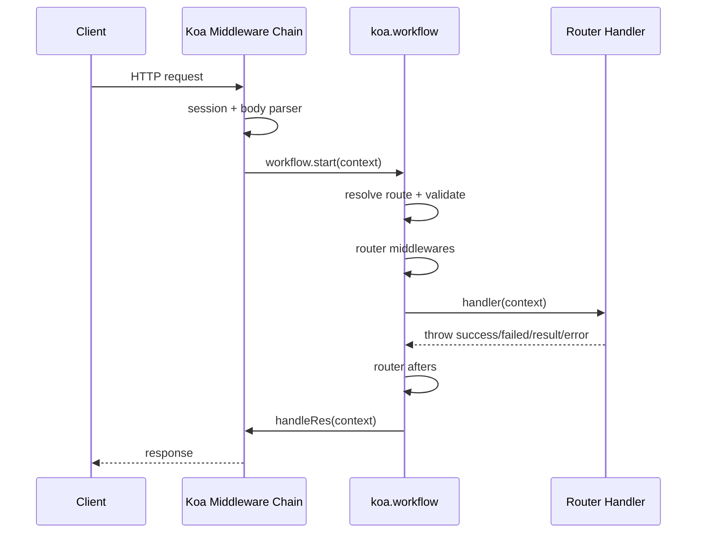

# @axiosleo/koapp Framework Overview

`@axiosleo/koapp` is a Node.js framework built on top of [Koa](https://koajs.com/) that provides three runtime modes (HTTP, TCP, WebSocket) behind a unified `Application` base, plus batteries-included helpers for routing, validation, response shaping, and Server-Sent Events.

Minimum Node.js version: **16.0.0**.

## Installation

```bash
npm install @axiosleo/koapp
```

## Core Exports

All symbols below come from `require('@axiosleo/koapp')`:

| Symbol | Kind | When to use |
| --- | --- | --- |
| `KoaApplication` | Class | Stand up an HTTP server on top of Koa |
| `SocketApplication` | Class | Stand up a TCP socket server (Node `net`) |
| `WebSocketApplication` | Class | Stand up a WebSocket server (the `ws` library) |
| `Application` | Class | Base class, rarely instantiated directly |
| `Router` | Class | Define routes, path params, validators, nested routers |
| `Controller` | Class | Base class to organize request handlers with response helpers |
| `Model` | Class | Structured validation (via `validatorjs`) + object serialization |
| `success` / `failed` / `result` / `response` / `error` | Functions | Throw-style response helpers consumed by the framework's workflow |
| `HttpError` / `HttpResponse` | Classes | Throwable error/response objects |
| `middlewares.KoaSSEMiddleware` | Factory | Attach a Server-Sent Events stream to a Koa route |
| `middlewares.KoaSessionMiddleware` | Re-export | `koa-session` for custom setups |
| `initContext` | Function | Advanced: build a framework context for custom transports |

Full quick-start example lives in [quick-start.md](quick-start.md).

## Class Hierarchy

```
EventEmitter
  └── Application (src/apps/app.js)
        ├── KoaApplication (src/apps/koa.js) - HTTP
        └── SocketApplication (src/apps/socket.js) - TCP
              └── WebSocketApplication (src/apps/websocket.js) - WebSocket
```

`WebSocketApplication` inherits all connection-management helpers
(`send`, `close`, `sendByConnectionId`, `closeByConnectionId`, `getConnection`,
`ping`, `broadcast`) from `SocketApplication`. Only the `send`, `close`, and
`broadcast` transport wrappers are overridden.

## Scenario Routing (pick the right skill)

When a task falls into one of these areas, prefer the specialized skill for
code-level guidance:

- Building an HTTP / TCP / WebSocket server → **koapp-apps**
- Defining routes, path params, nested routers, validators → **koapp-router**
- Returning JSON / HTML / custom status responses → **koapp-response**
- Organizing handlers into classes with shared helpers → **koapp-controller**
- Validating and serializing structured payloads → **koapp-model**
- Pushing real-time events to the browser over HTTP → **koapp-sse**

## Request Lifecycle (Koa path)



The `response` functions (`success`, `failed`, `result`, `response`, `error`)
deliberately **throw** a typed object that the workflow catches and turns into
the actual Koa or socket response. Inside handlers, call them and `return` is
implicit - no need to `return` the result of `success(...)`.

## Conventions enforced by the framework

1. Code uses `'use strict'`, CommonJS, and async/await - follow suit in user
   code unless the target project uses TypeScript (see `assets/tmpl/`).
2. Response payloads (JSON) are always wrapped as
   `{ request_id, timestamp, code, message, data }`. `code` is a
   `"<status>;<message>"` string.
3. Path parameters use `/{:name}` syntax, e.g. `/users/{:id}/posts/{:postId}`.
   Legacy `:name` is also accepted but `{:name}` is preferred.
4. A router with `method` unset (or empty string) is effectively disabled -
   requests will resolve to the fallback `/***` handler.
5. Validation rules use [validatorjs](https://github.com/mikeerickson/validatorjs)
   syntax and live under `validators.params|query|body`.

## When NOT to use koapp directly

- Pure static file serving without API - `koa-static` alone is lighter
- Heavy enterprise microservices needing opinionated DI / RPC - use NestJS
- Edge-runtime deployments (Cloudflare Workers / Vercel Edge) - the framework
  depends on Node-only APIs (`net`, `ws`, `fs`)

## Related Resources

- Quick start walkthrough: [quick-start.md](quick-start.md)
- Published on npm: `@axiosleo/koapp`
- Source: https://github.com/AxiosLeo/node-koapp
