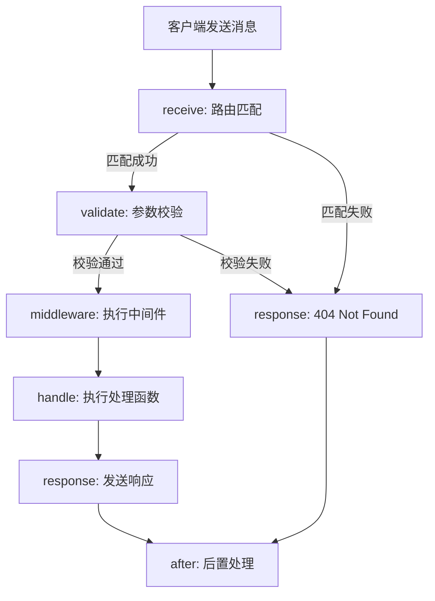

# WebSocketApplication 使用文档

## 概述

`WebSocketApplication` 是 `@axiosleo/koapp` 框架提供的原生 WebSocket 服务端实现，基于 [ws](https://github.com/websockets/ws) 库构建，继承自框架的 `Application` 基类。它复用了与 `KoaApplication` 相同的路由、中间件、验证等机制，让你可以用统一的方式开发 HTTP 和 WebSocket 服务。

## 安装与引入

```bash
npm install @axiosleo/koapp
```

```javascript
const { WebSocketApplication, Router } = require('@axiosleo/koapp');
```

## 快速开始

```javascript
const { WebSocketApplication, Router, success } = require('@axiosleo/koapp');

const router = new Router();

router.any('/hello', async (context) => {
  success({ message: 'Hello, WebSocket!' });
});

const app = new WebSocketApplication({
  port: 8081,
  routers: [router],
});

app.start();
```

## 配置选项

`WebSocketApplication` 的配置类型为 `WebSocketAppConfiguration`，由基础应用配置、Socket 配置和 `ws` 库的 `ServerOptions` 合并而成。

### 基础配置

| 参数 | 类型 | 默认值 | 说明 |
|------|------|--------|------|
| `port` | `number` | `8081` | 监听端口 |
| `debug` | `boolean` | `false` | 是否开启调试模式 |
| `app_id` | `string` | 自动生成 UUID | 应用唯一标识 |
| `routers` | `Router[]` | `[]` | 路由列表 |

### Ping 心跳配置

通过 `ping` 字段配置心跳检测，用于保持客户端连接活跃：

| 参数 | 类型 | 默认值 | 说明 |
|------|------|--------|------|
| `ping.open` | `boolean` | `false` | 是否开启心跳 |
| `ping.interval` | `number` | `300000` (5分钟) | 心跳间隔，单位毫秒 |
| `ping.data` | `any` | `'this is a ping message'` | 心跳数据内容 |

### ws ServerOptions

除上述配置外，其余参数将直接传递给 `ws` 库的 `WebSocketServer` 构造函数，常用参数包括：

| 参数 | 类型 | 说明 |
|------|------|------|
| `clientTracking` | `boolean` | 是否跟踪客户端连接 |
| `maxPayload` | `number` | 最大消息负载大小（字节） |
| `perMessageDeflate` | `boolean\|object` | 消息压缩配置 |
| `backlog` | `number` | 挂起连接队列的最大长度 |

### 配置示例

```javascript
const app = new WebSocketApplication({
  port: 8081,
  debug: true,
  app_id: 'my-ws-app',
  routers: [router],

  // 心跳配置
  ping: {
    open: true,
    interval: 1000 * 30, // 30 秒
    data: 'ping',
  },

  // ws ServerOptions
  clientTracking: true,
  maxPayload: 1024 * 1024, // 1MB
});
```

## 路由定义

WebSocketApplication 复用框架的 `Router` 类，与 KoaApplication 使用相同的路由定义方式。

### 基本路由

```javascript
const router = new Router();

// 匹配所有方法
router.any('/chat', async (context) => {
  success({ received: context.body });
});

// 匹配特定方法
router.get('/status', async (context) => {
  success({ status: 'online' });
});

router.post('/message', async (context) => {
  success({ saved: true });
});
```

### 路径参数

使用 `{:paramName}` 语法定义动态路径参数：

```javascript
router.any('/room/{:roomId}/user/{:userId}', async (context) => {
  const { roomId, userId } = context.params;
  success({ roomId, userId });
});
```

### 路由分组

通过前缀和嵌套实现路由分组：

```javascript
const apiRouter = new Router('/api/v1');

apiRouter.any('/users', async (context) => {
  success({ users: [] });
});

apiRouter.any('/rooms/{:id}', async (context) => {
  success({ room: context.params.id });
});

const app = new WebSocketApplication({
  port: 8081,
  routers: [apiRouter],
});
```

### 请求验证

路由支持基于 [validatorjs](https://github.com/mikeerickson/validatorjs) 的参数验证：

```javascript
router.post('/message/{:roomId}', async (context) => {
  success({ saved: true });
}, {
  params: {
    rules: { roomId: 'required|string' }
  },
  query: {
    rules: { token: 'required' }
  },
  body: {
    rules: {
      content: 'required|string',
      type: 'required|in:text,image',
    },
    messages: {
      'required': ':attribute 不能为空',
    }
  }
});
```

验证失败时自动返回 400 错误响应，包含详细的错误信息。

### 中间件与后置处理

```javascript
const router = new Router('/api', {
  // 中间件 - 在 handler 之前执行
  middlewares: [
    async (context) => {
      console.log(`收到消息: ${context.method} ${context.pathinfo}`);
    },
  ],
  // 后置处理 - 在响应之后执行
  afters: [
    async (context) => {
      console.log('请求处理完成');
    },
  ],
});
```

## 客户端消息协议

客户端发送的 WebSocket 消息必须为 JSON 字符串，结构如下：

```json
{
  "path": "/api/v1/message",
  "method": "POST",
  "query": { "token": "abc123" },
  "content": "hello",
  "type": "text"
}
```

### 字段说明

| 字段 | 说明 | 映射到 |
|------|------|--------|
| `path` | 路由路径（必须与 URL pathname 一致） | 由 WebSocket 连接的 URL pathname 决定 |
| `method` | 请求方法 | 由 HTTP 升级请求的 method 决定 |
| 其余字段 | 消息体数据 | `context.body` |

> **注意**: 客户端发送的整个 JSON 对象会被解析并传递给 dispatcher。`path` 和 `method` 来自 WebSocket 连接的 HTTP 升级请求的 URL 和 method，而 JSON 消息体整体作为 `context.body`。`query` 来自连接时 URL 中的查询参数（如 `?token=123`），会自动解析为对象 `{ token: "123" }`。

### 客户端连接示例

**浏览器端：**

```javascript
const ws = new WebSocket('ws://localhost:8081/api/v1/chat?token=abc123');

ws.onopen = () => {
  ws.send(JSON.stringify({
    content: 'Hello!',
    type: 'text'
  }));
};

ws.onmessage = (event) => {
  const response = JSON.parse(event.data);
  console.log(response);
};
```

**Node.js 端：**

```javascript
const WebSocket = require('ws');

const ws = new WebSocket('ws://localhost:8081/api/v1/chat?token=abc123');

ws.on('open', () => {
  ws.send(JSON.stringify({
    content: 'Hello from Node.js!',
    type: 'text'
  }));
});

ws.on('message', (data) => {
  const response = JSON.parse(data.toString());
  console.log(response);
});
```

## 请求处理流程

每条 WebSocket 消息经过以下处理流程：

```
receive → validate → middleware → handle → response → after
```

### 流程详解

| 阶段 | 说明 | 触发事件 |
|------|------|----------|
| **receive** | 解析路由，匹配路径和方法，提取路径参数 | `receive` |
| **validate** | 校验 params、query、body 参数（基于路由配置的 validators） | `validate` |
| **middleware** | 执行路由级中间件 | `middleware` |
| **handle** | 执行路由处理函数（handlers） | `handle` |
| **response** | 构建响应并通过 WebSocket 发送给客户端 | `response` |
| **after** | 执行后置处理函数 | `request_end` |

任何阶段抛出异常都会跳转到 `response` 阶段进行错误处理。

### 流程图



## 上下文对象 (SocketContext)

处理函数接收的 `context` 对象包含以下属性：

| 属性 | 类型 | 说明 |
|------|------|------|
| `context.app` | `WebSocketApplication` | 应用实例，可访问配置和方法 |
| `context.app_id` | `string` | 应用唯一标识 |
| `context.socket` | `WebSocket` | 当前客户端的 WebSocket 连接 |
| `context.method` | `string` | 请求方法（GET、POST 等） |
| `context.pathinfo` | `string` | 请求路径 |
| `context.params` | `object` | 路径参数 |
| `context.query` | `object` | 查询参数 |
| `context.body` | `object` | 消息体（客户端发送的 JSON） |
| `context.headers` | `object` | HTTP 升级请求的头信息 |
| `context.request_id` | `string` | 请求唯一标识（自动生成） |
| `context.router` | `RouterInfo` | 匹配到的路由信息 |
| `context.response` | `HttpResponse\|HttpError` | 响应对象 |

### 使用示例

```javascript
router.any('/echo', async (context) => {
  console.log('请求 ID:', context.request_id);
  console.log('路径:', context.pathinfo);
  console.log('方法:', context.method);
  console.log('参数:', context.params);
  console.log('查询:', context.query);
  console.log('消息体:', context.body);
  console.log('请求头:', context.headers);

  // 直接通过 socket 发送原始数据
  // context.socket.send('raw message');

  // 使用响应方法（推荐）
  success({ echo: context.body });
});
```

## 响应方法

框架提供统一的响应方法，通过 `throw` 机制中断处理并构建响应：

### success(data, headers)

发送成功响应（code: 200）：

```javascript
const { success } = require('@axiosleo/koapp');

router.any('/hello', async (context) => {
  success({ message: 'Hello!' });
});
```

### failed(data, code, status, headers)

发送失败响应：

```javascript
const { failed } = require('@axiosleo/koapp');

router.any('/login', async (context) => {
  if (!context.body.token) {
    failed({ reason: '缺少令牌' }, '401;Unauthorized', 401);
  }
  success({ user: 'authenticated' });
});
```

### error(status, msg, headers)

发送错误响应：

```javascript
const { error } = require('@axiosleo/koapp');

router.any('/admin', async (context) => {
  error(403, 'Forbidden');
});
```

### result(data, status, headers)

发送原始响应数据（不进行 JSON 包装）：

```javascript
const { result } = require('@axiosleo/koapp');

router.any('/raw', async (context) => {
  result('raw string data');
});
```

### JSON 响应格式

使用 `success`、`failed`、`error` 等方法时，客户端收到的 JSON 响应格式为：

```json
{
  "request_id": "550e8400-e29b-41d4-a716-446655440000",
  "timestamp": 1711267200000,
  "code": "200",
  "message": "Success",
  "data": {
    "message": "Hello!"
  }
}
```

### 使用 Controller

也可以通过继承 `Controller` 类来组织处理逻辑：

```javascript
const { Controller } = require('@axiosleo/koapp');

class ChatController extends Controller {
  async sendMessage(context) {
    const { content, type } = context.body;
    // 业务逻辑...
    this.success({ sent: true });
  }

  async getHistory(context) {
    const { roomId } = context.params;
    // 获取历史消息...
    this.success({ messages: [] });
  }
}

const chatCtrl = new ChatController();

router.post('/message', (ctx) => chatCtrl.sendMessage(ctx));
router.get('/history/{:roomId}', (ctx) => chatCtrl.getHistory(ctx));
```

## 广播功能

`WebSocketApplication` 提供 `broadcast` 方法，用于向多个客户端发送消息。

### 方法签名

```javascript
app.broadcast(data, msg, code, connections);
```

| 参数 | 类型 | 默认值 | 说明 |
|------|------|--------|------|
| `data` | `any` | `''` | 广播数据 |
| `msg` | `string` | `'ok'` | 消息文本 |
| `code` | `number` | `0` | 状态码 |
| `connections` | `WebSocket[]\|object\|null` | `[]` | 目标连接列表 |

### connections 参数行为

- `null` — 广播给所有已连接的客户端
- `WebSocket[]`（数组） — 广播给数组中的特定连接
- `object`（键值对） — 广播给对象中所有值对应的连接

### 广播示例

```javascript
// 在路由处理器中广播
router.post('/broadcast', async (context) => {
  // 广播给所有客户端
  context.app.broadcast(
    { announcement: '系统维护通知' },
    'notification',
    0,
    null
  );
  success({ broadcasted: true });
});
```

### 广播消息格式

客户端收到的广播消息格式为：

```json
{
  "request_id": "auto-generated-uuid",
  "timestamp": 1711267200000,
  "code": 0,
  "message": "notification",
  "data": {
    "announcement": "系统维护通知"
  }
}
```

## 事件系统

WebSocketApplication 继承自 `EventEmitter`，支持丰富的事件监听。

### 应用级事件

| 事件 | 触发时机 | 回调参数 |
|------|----------|----------|
| `starting` | 应用构造时 | `(app)` |
| `listen` | 服务启动监听时 | `(port)` |
| `connection` | 新客户端连接时 | `(ws, request)` |
| `response` | 每次响应发送时 | `(context)` |

### 工作流事件

| 事件 | 触发时机 | 回调参数 |
|------|----------|----------|
| `receive` | 路由匹配阶段 | `(context)` |
| `validate` | 参数校验阶段 | `(context)` |
| `middleware` | 中间件执行阶段 | `(context)` |
| `handle` | 处理函数执行阶段 | `(context)` |
| `request_end` | 请求结束后 | `(context)` |
| `after_error` | 后置处理出错时 | `(context, error)` |

### 事件监听示例

```javascript
const app = new WebSocketApplication({
  port: 8081,
  routers: [router],
});

// 服务启动
app.event.on('listen', (port) => {
  console.log(`WebSocket 服务已启动，端口: ${port}`);
});

// 新连接
app.event.on('connection', (ws, request) => {
  console.log('新客户端连接:', request.url);
});

// 工作流事件（通过 app.on）
app.on('receive', (context) => {
  console.log(`收到请求: ${context.method} ${context.pathinfo}`);
});

app.on('response', (context) => {
  console.log(`响应状态: ${context.response.status}`);
});

app.on('request_end', (context) => {
  console.log(`请求处理完成: ${context.request_id}`);
});

app.start();
```

> **注意**: `listen` 和 `connection` 事件通过 `app.event`（内部 EventEmitter）监听，而工作流事件（`receive`、`response` 等）通过 `app.on`（Application 自身继承的 EventEmitter）监听。

## 连接管理

WebSocketApplication 通过 `app.connections` 对象管理所有活跃连接，键为自动生成的 `connection_id`，值为 `WebSocket` 实例。

```javascript
// 获取当前连接数
const count = Object.keys(app.connections).length;

// 遍历所有连接
Object.entries(app.connections).forEach(([id, ws]) => {
  ws.send('Hello from server');
});
```

连接在客户端断开时自动从 `connections` 中移除。

## 完整示例

以下示例展示了一个完整的 WebSocket 聊天服务：

```javascript
'use strict';

const {
  WebSocketApplication,
  Router,
  Controller,
  success,
  failed,
  error
} = require('@axiosleo/koapp');

// 定义 Controller
class ChatController extends Controller {
  async join(context) {
    const { roomId } = context.params;
    const { nickname } = context.body;
    // 广播通知
    context.app.broadcast(
      { event: 'user_joined', nickname, roomId },
      'user_joined',
      0,
      null
    );
    this.success({ joined: roomId, nickname });
  }

  async sendMessage(context) {
    const { roomId } = context.params;
    const { content, type } = context.body;
    context.app.broadcast(
      { roomId, content, type, timestamp: Date.now() },
      'new_message',
      0,
      null
    );
    this.success({ sent: true });
  }
}

const chatCtrl = new ChatController();

// 定义路由
const router = new Router('/chat', {
  middlewares: [
    async (context) => {
      // 简单的认证检查
      if (!context.query.token) {
        error(401, 'Unauthorized');
      }
    },
  ],
});

router.post('/room/{:roomId}/join', (ctx) => chatCtrl.join(ctx), {
  params: {
    rules: { roomId: 'required|string' }
  },
  body: {
    rules: { nickname: 'required|string|min:2|max:20' },
    messages: { 'required': ':attribute 不能为空' }
  }
});

router.post('/room/{:roomId}/message', (ctx) => chatCtrl.sendMessage(ctx), {
  params: {
    rules: { roomId: 'required|string' }
  },
  body: {
    rules: {
      content: 'required|string',
      type: 'required|in:text,image,file'
    }
  }
});

router.get('/status', async () => {
  success({ status: 'online' });
});

// 创建应用
const app = new WebSocketApplication({
  port: 8081,
  debug: true,
  routers: [router],
  ping: {
    open: true,
    interval: 1000 * 30,
    data: JSON.stringify({ type: 'ping' }),
  },
});

// 事件监听
app.event.on('listen', (port) => {
  console.log(`聊天服务已启动: ws://localhost:${port}`);
});

app.event.on('connection', (ws, request) => {
  console.log('新用户连接:', request.url);
  ws.send(JSON.stringify({
    code: 0,
    message: 'welcome',
    data: { message: '欢迎连接聊天服务' }
  }));
});

app.on('request_end', (context) => {
  console.log(`[${context.request_id}] ${context.method} ${context.pathinfo} 处理完成`);
});

// 启动
app.start();
```

### 对应的客户端代码

```javascript
const ws = new WebSocket('ws://localhost:8081/chat/room/general/join?token=my-token');

ws.onopen = () => {
  // 加入房间
  ws.send(JSON.stringify({
    nickname: 'Alice',
  }));
};

ws.onmessage = (event) => {
  const data = JSON.parse(event.data);
  console.log('收到:', data);
};

ws.onerror = (err) => {
  console.error('连接错误:', err);
};

ws.onclose = () => {
  console.log('连接关闭');
};
```
